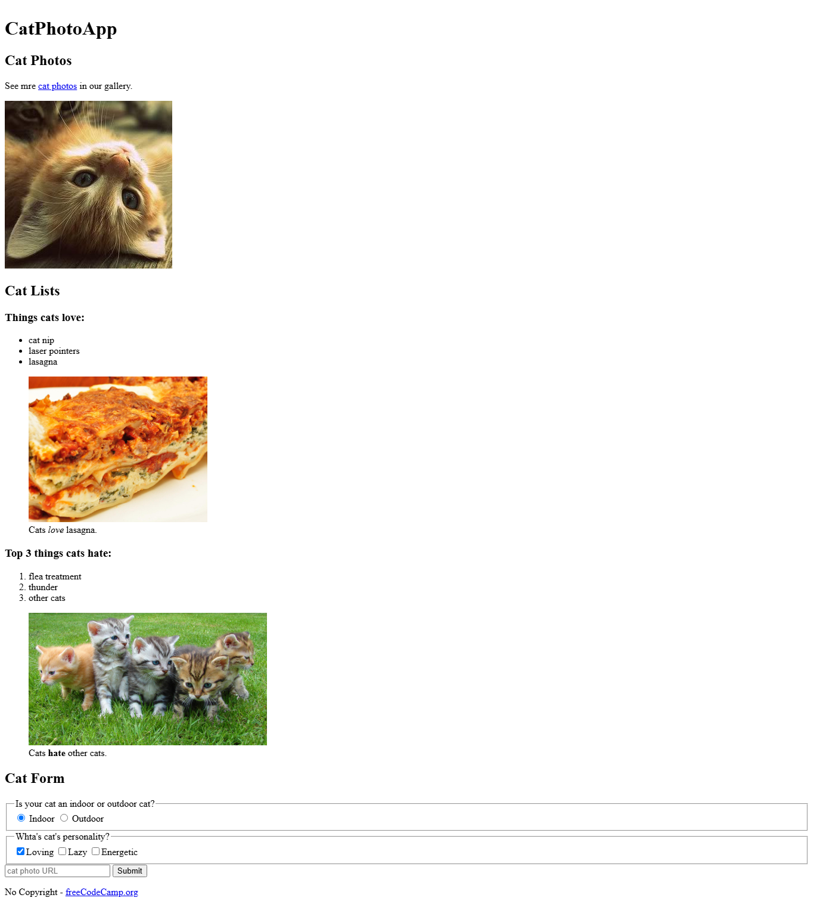
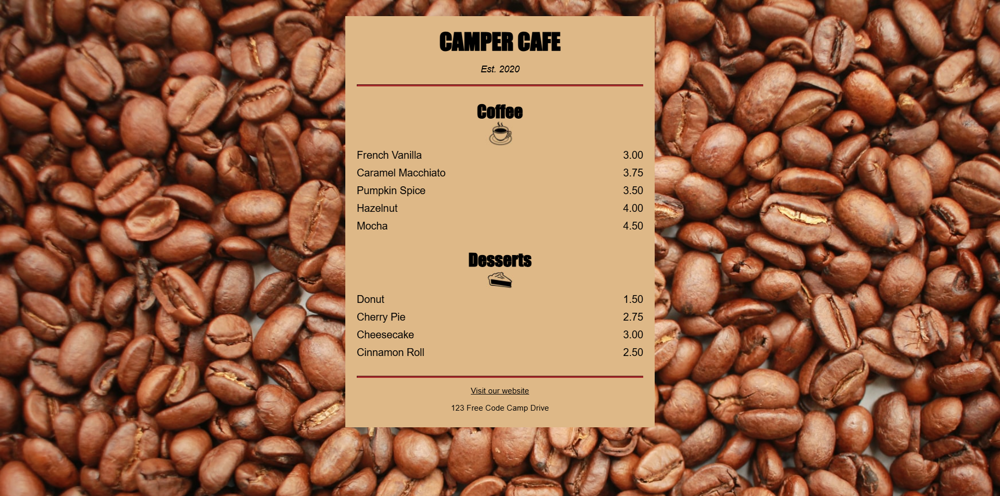

# freeCodeCamp

## Responsive Web Design Certification (RWDC)

### (C1) Learn HTML by Building a Cat Photo App (Completed)

### (C2) Learn Basic CSS by Building a Cafe Manu (Completed)

### (C3) Learn CSS Colors by Building a Set of Colored Markers (In progress)